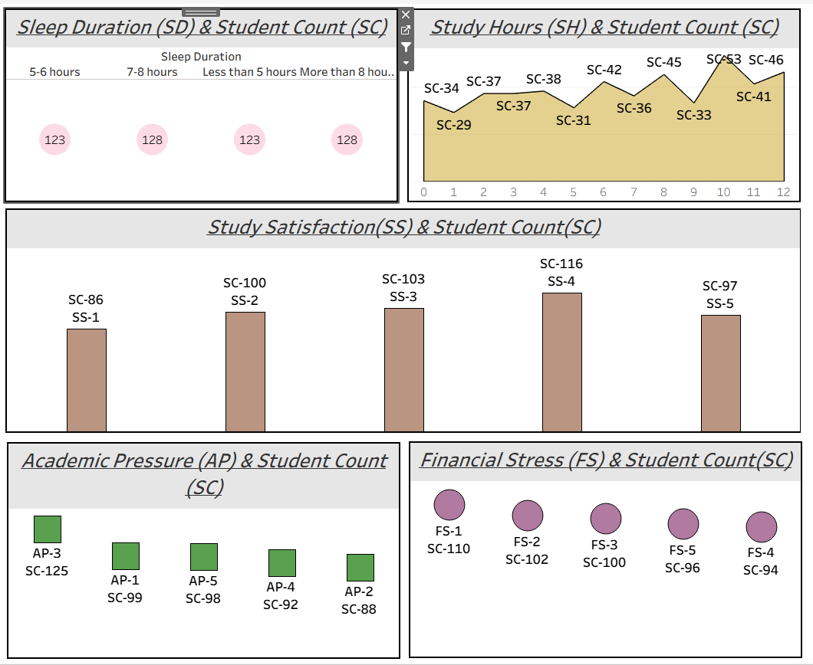
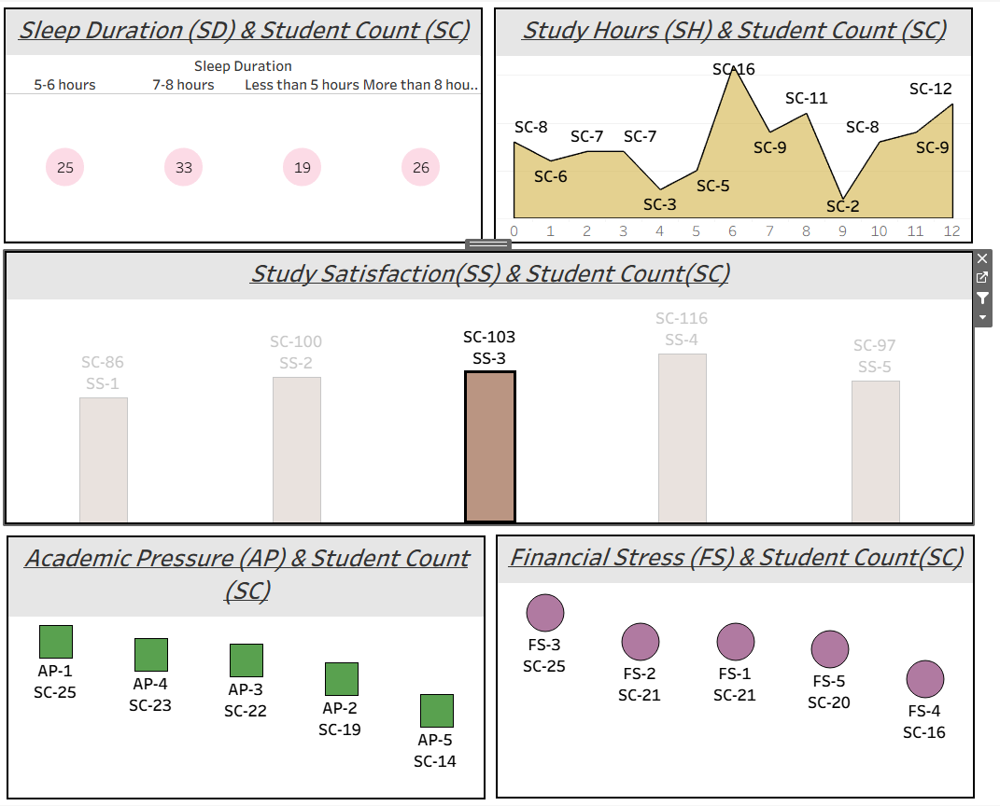

# SQL-Tableau-Project---Student-Count-Analysis
An end-to-end **Student Count Analysis Project** using **SQL** for data preprocessing and **Tableau** for interactive visualization.  
The project highlights the relationship between student demographics, mental health, and academic efforts.

---

## 🔗 Table of Contents
- [📘 Project Overview](#-project-overview)
- [📁 Folder Structure](#-folder-structure)
- [📦 SQL Preprocessing](#-sql-preprocessing)
- [📊 Tableau Dashboard](#-tableau-dashboard)
- [📸 Dashboard Images](#-dashboard-images)
- [🛠️ Tools Used](#️-tools-used)
- [✍️ Author](#-author)

---

## 📘 Project Overview
The analysis focuses on:
- % of students in **depression**  
- % of students under **financial stress**  
- **Study hours distribution** across students  
- Correlation between **mental health & academics**  

---

## 📁 Folder Structure

student-count-analysis-sql-tableau/
│
├── 01_Data/
│ └── students_raw.csv
│
├── 02_SQL_Scripts/
│ └── student_data_cleaning.sql
│
├── 03_Tableau_Dashboard/
│ └── Tableau_Dashboard_Link.txt
│
├── 04_Images/
│ ├── 1.png
│ ├── 2.png
│
└── README.md

---

## 📦 SQL Preprocessing
Data was first cleaned and transformed using **MySQL**:
- Converted **Gender** values to short form (e.g., Male → `M`)  
- Created a derived **Age Group column** for categorization  
- Added an **Index column** for unique identification  

📂 [View SQL Script](./02_SQL_Scripts/student_data_cleaning.sql)

---

## 📊 Tableau Dashboard
Interactive Tableau dashboard link:  
👉 [View Dashboard on Tableau Cloud](https://prod-apsoutheast-b.online.tableau.com/#/site/gulbaazmansuri-f870665576/workbooks/634777/views)

---

## 📸 Dashboard Images
  
  

---

## 🛠️ Tools Used
- **MySQL** – Data preprocessing & cleaning  
- **Tableau** – Dashboard creation & visualization  
- **SQL** – Queries & transformations  

---

## ✍️ Author
**Gulbaaz**  
DTU’22 | Aspiring Data & Business Analyst | SQL, Tableau, Power BI Projects on GitHub  
📫 [GitHub Profile](https://github.com/Gulbaaz)
